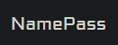

<div id="top"></div>
<!--
*** Credit to Othneil Drew's Best-README-Template as the base
*** for this template and concept/layout. The following is an iteration
*** from that version, and contains similar structure, with some improvements
*** to allow for easy automation of the README generation process.
*** Check it out: https://github.com/othneildrew/Best-README-Template/
*** For more information about this README template version
*** see the following repo: https://github.com/taqft/auto-readme
-->

<!-- PROJECT SHIELDS -->
<!--
*** Reference links are enclosed in brackets [ ] instead of parentheses ( ).
*** See the bottom of this document for the declaration of the reference variables
*** for contributors-url, forks-url, etc. This is an optional, concise syntax you may use.
*** https://www.markdownguide.org/basic-syntax/#reference-style-links
-->
[![Contributors][contributors-shield]][contributors-url]
[![Forks][forks-shield]][forks-url]
[![Stargazers][stars-shield]][stars-url]
[![Issues][issues-shield]][issues-url]
[![License][license-shield]][license-url]


<!-- PROJECT LOGO -->
<br />
<div align="center">
  <a href="https://github.com/taqft/NamePassPro">
    
  </a>

<h3 align="center">NamePassPro Username & Password Generator</h3>

  <p align="center">
    Generate random usernames and passwords quickly and easily!
    <br />
    <a href="https://namepass.herokuapp.com/">View Demo</a>
    ·
    <a href="https://github.com/taqft/NamePassPro/issues">Report Bug</a>
    ·
    <a href="https://github.com/taqft/NamePassPro/issues">Request Feature</a>
  </p>
</div>

<!-- TABLE OF CONTENTS -->
## Table of Contents

* [Description](#description)
* [Installation](#installation)
* [Usage](#usage)
* [License](#license)
* [Contributing](#contributing)
* [Testing](#testing)
* [Questions](#questions)
* [Demo](#demo)

<!-- DESCRIPTION -->
## Description

* A cool app to help remove the mental load thinking of constant usernames and passwords!

* Built with NodeJS and Handlebars, this simple app allows you to generate usernames and passwords based on your desired criteria. We worked on this to save time when spinning up new test accounts, and to serve as a base for future improvements and features to make our lives easier.

* This README file was generated with [auto-readme](https://github.com/taqft/auto-readme/)! Go check it out if you're interested in learning more!

<p align="right">(<a href="#top">back to top</a>)</p>

<!-- INSTALLATION -->
## Installation

1. Clone the repo with your preferred method
```sh
git clone git@github.com:taqft/NamePassPro.git
```
2. Install NPM packages
```sh
npm install
```
3. Add your local .env file for use with a local mysql server + sequelize
```sh
DB_NAME=namepass_db
DB_USER=root
DB_PW=your_pw_here
SESSION_SECRET=super_secret
```
4. If you wish to seed your local db with sample words, be sure you have sequelize-cli installed then run the following.
-Note that [sequelize-cli](https://www.npmjs.com/package/sequelize-cli) is only needed for development, so we save it as a dev dependency.
```
npm install --save-dev sequelize-cli
npx sequelize-cli init
  open /config/config.json and fill in your local root info:
    "username": "root",
    "password": "your_pw_here",
    "database": "namepass_db",
npx sequelize-cli db:seed:all
```


<p align="right">(<a href="#top">back to top</a>)</p>

<!-- USAGE -->
## Usage

* You must choose at least one username option before generation will succeed.

* You must choose at least one password option before generation will succeed.

* You must first sign up and be logged in before the app can save your credentials.


<p align="right">(<a href="#top">back to top</a>)</p>

<!-- LICENSE -->
## License

* This application is covered under the GPL-2.0 License.

<p align="right">(<a href="#top">back to top</a>)</p>

<!-- CONTRIBUTING -->
## Contributing

Any contributions you make are greatly appreciated.

Guidelines: Fork this repo, and submit a PR with detailed notes!

If you have a suggestion that would make this better, please fork the repo and create a pull request.
You can also simply open an issue with the tag "enhancement".
Don't forget to give the project a star if you liked it!

1. Fork the Project
2. Create your Feature Branch (`git checkout -b feature/AmazingFeature`)
3. Commit your Changes (`git commit -m 'Add some AmazingFeature'`)
4. Push to the Branch (`git push origin feature/AmazingFeature`)
5. Open a Pull Request

<p align="right">(<a href="#top">back to top</a>)</p>

<!-- TESTING -->
## Testing

* There is no testing suite included in this package currently.

<p align="right">(<a href="#top">back to top</a>)</p>

<!-- QUESTIONS -->
## Questions

* Have questions?
* Reach out to us: 

* Tim Carrier

[![portfolio][portfolio-shield]](https://atmention.github.io/code_portfolio)
[![linkedin][linkedin-shield]](https://www.linkedin.com/in/tim-carrier-9a2a9a22/)

* Rick Ansay

[![portfolio][portfolio-shield]](https://rickyricer.github.io/RickAnsayFullStackPortfolio)
[![linkedin][linkedin-shield]](https://www.linkedin.com/mwlite/in/rick-ansay-185201b1)

* Ben Koenig

[![portfolio][portfolio-shield]](https://taqft.github.io/code_portfolio/)
[![linkedin][linkedin-shield]](https://www.linkedin.com/in/bk09/)

* Stephen Garcia

[![portfolio][portfolio-shield]](https://stephen-garcia.github.io/MyPersonalPortfolio)
[![linkedin][linkedin-shield]](https://www.linkedin.com/in/stephen-garcia-8b9666227/)

<p align="right">(<a href="#top">back to top</a>)</p>

<!-- PROJECT EXAMPLE -->
## Demo

* The app is live on Heroku!

* Check it out here: [namepass.herokuapp.com](https://namepass.herokuapp.com/)

<p align="right">(<a href="#top">back to top</a>)</p>


<!-- MARKDOWN LINKS & IMAGES -->
<!-- https://www.markdownguide.org/basic-syntax/#reference-style-links -->
[contributors-shield]: https://img.shields.io/github/contributors/taqft/NamePassPro.svg?style=for-the-badge
[contributors-url]: https://github.com/taqft/NamePassPro/graphs/contributors
[forks-shield]: https://img.shields.io/github/forks/taqft/NamePassPro.svg?style=for-the-badge
[forks-url]: https://github.com/taqft/NamePassPro/network/members
[stars-shield]: https://img.shields.io/github/stars/taqft/NamePassPro.svg?style=for-the-badge
[stars-url]: https://github.com/taqft/NamePassPro/stargazers
[issues-shield]: https://img.shields.io/github/issues/taqft/NamePassPro.svg?style=for-the-badge
[issues-url]: https://github.com/taqft/NamePassPro/issues
[license-shield]: https://img.shields.io/github/license/taqft/NamePassPro.svg?style=for-the-badge&cacheSeconds=60
[license-url]: https://github.com/taqft/NamePassPro/blob/main/LICENSE
[linkedin-shield]: https://img.shields.io/badge/-LinkedIn-black.svg?style=for-the-badge&logo=linkedin&colorB=555
[portfolio-shield]: https://img.shields.io/badge/my_portfolio-000?style=for-the-badge&logo=ko-fi&logoColor=white
